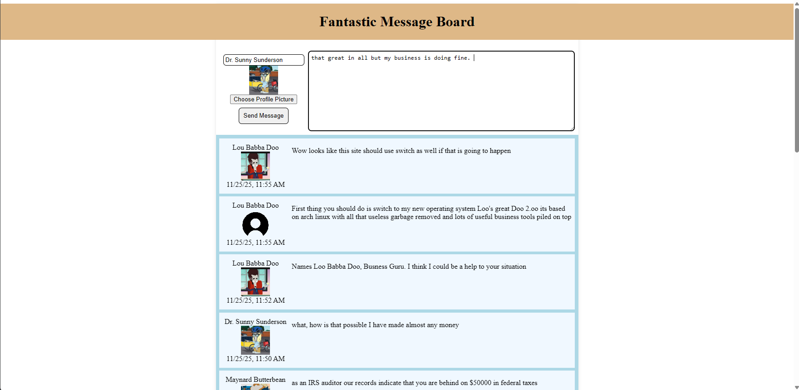
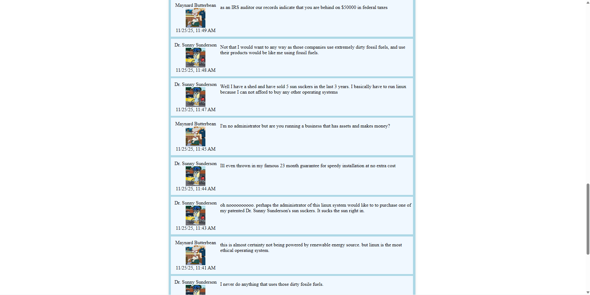

# Fantastic Message Board
A simple message board system


## Setup
1. install nodejs >= 19
2. install mysql server
3. setup root access on the database
4. run the SQL quererys in `init_database_setup.sql` make sure to set a good account password
5. copy `.env.example` to `.env`
6. edit `.env` set the database password you created earlier in both the `DATABASE_URL` and `DATABASE_PASSWORD` fields. NOTE: make sure the password in the `DATABASE_URL` is URI encoded 
7. configure any other env changes like SSL
8. create the auto start service with the following service file. Make sure you change the file path to where you place this repo
```service
[Unit]
Descripton=Fantastic message board website service
After=network.target

[Service]
ExecStart=/path/to/project/run.sh

[Install]
WantedBy=multi-user.target
```
9. mark `run.sh` as executable 

## Running
```shell
./run.sh
```


## Architecture
This project consists of a website hosted from a fastify backend.  
This back end communicates with a database to store and retrieve messages and profile pictures that were sent by users in the past.  
The schema of this database is managed by dbmate witch allows for any schema changes to be easily distributed across many deployments without requiring manual changes to the database.  
The user in the web browser can interact with the web server to post new message or get messages that have already been sent


## Usage
For how to set the service up look at the setup section above
To use the service, open your web browser and navigate to the ipaddress of this severer. The default port is 3000 but check what is configured in your setup. If useing https then you will need to specify the https protocol.
Once you have loaded the page, you can scroll down to see the conversation that has taken place.   
At the top of the page is a box for you to enter your own message into. The smaller text box next to the message box is where you can set your username.  
Optionally you can choose an image from your computer to use as your profile picture.   
After your message, username and profile pic are all set you can click on the send message button and your message will appear in the stream within 5 seconds


## Screenshots


